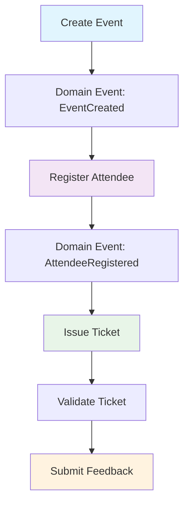

# 🎯 Modular Monolith Event Management System

> A comprehensive .NET 9 implementation showcasing **Modular Monolith Architecture** patterns and best practices for enterprise applications.

[](https://dotnet.microsoft.com/)
[](https://www.docker.com/)
[](https://opensource.org/licenses/MIT)

## 🏗️ Architecture Highlights

### Modular Design
- **4 Self-contained Modules**: Event, Attendee, Ticket, Feedback
- **Domain-Driven Design** principles with rich domain models
- **Clean Architecture** within each module (Domain → Application → Infrastructure)
- **Loose Coupling** via domain events and shared kernel

### Technical Excellence
- **.NET 9** with latest C# features and performance improvements
- **CQRS Pattern** with MediatR for command/query separation
- **Domain Events** for inter-module asynchronous communication
- **FluentValidation** with pipeline behaviors for input validation
- **Entity Framework Core** with In-Memory database for development

## 🚀 Key Features Demonstrated

### 1. 📦 Module Independence
Each module maintains its own:
```
src/Modules/{ModuleName}/
├── Domain/           # Entities, Value Objects, Domain Events
├── Application/      # Use Cases, Commands, Queries, Handlers
└── Infrastructure/   # Repositories, DbContext, Configuration
```

### 2. 🔄 Inter-Module Communication
- **Domain Events**: Asynchronous communication between modules
- **Event Handlers**: Cross-module business logic coordination
- **Shared Kernel**: Common domain concepts and infrastructure

```csharp
// Event created in Event module
public record EventCreatedDomainEvent(Guid EventId, string EventName, ...) : DomainEvent;

// Handled in Attendee module
public class EventCreatedDomainEventHandler : INotificationHandler<EventCreatedDomainEvent>
{
    // Initialize attendee-related processes
}
```

### 3. 🎯 CQRS Implementation
- **Commands**: Write operations with business logic validation
- **Queries**: Read operations with optimized data transfer objects
- **Pipeline Behaviors**: Cross-cutting concerns (validation, logging)

### 4. ✅ Validation Pipeline
- **FluentValidation** rules for all commands
- **Pipeline Behavior** for automatic validation
- **Comprehensive error handling** with meaningful messages

### 5. 🧪 Testing Strategy
- **Integration Tests** for complete workflow scenarios
- **API Testing** with WebApplicationFactory
- **Domain Logic Testing** with comprehensive coverage

## 📊 Business Flow



## 🛠️ Technology Stack

| Category | Technology |
|----------|------------|
| **Framework** | .NET 9, ASP.NET Core Web API |
| **Patterns** | Modular Monolith, CQRS, DDD, Clean Architecture |
| **Messaging** | MediatR for in-process messaging |
| **Validation** | FluentValidation with pipeline behaviors |
| **Database** | Entity Framework Core (In-Memory/SQL Server) |
| **Testing** | xUnit, WebApplicationFactory |
| **Containerization** | Docker, Docker Compose |

## 🚀 Getting Started

### Prerequisites
- [.NET 9 SDK](https://dotnet.microsoft.com/download/dotnet/9.0)
- [Docker](https://www.docker.com/) (optional)
- [Visual Studio 2022](https://visualstudio.microsoft.com/) or [VS Code](https://code.visualstudio.com/)

### Running Locally

1. **Clone the repository**
```bash
git clone https://github.com/yourusername/ModularMonolithSample.git
cd ModularMonolithSample
```

2. **Run the application**
```bash
dotnet run --project src/API/ModularMonolithSample.API
```

3. **Access Swagger UI**
```
https://localhost:5001/swagger
```

### Running with Docker

```bash
# Build and run with docker-compose
docker-compose up --build

# Access the API
curl https://localhost:5001/api/events
```

## 📋 API Endpoints

### Events Module
- `GET /api/events/{id}` - Get event details
- `POST /api/events` - Create new event

### Attendees Module  
- `POST /api/attendees` - Register attendee for event

### Tickets Module
- `POST /api/tickets` - Issue ticket for registered attendee

### Feedback Module
- `POST /api/feedback` - Submit event feedback

## 🧪 Testing

```bash
# Run all tests
dotnet test

# Run integration tests specifically
dotnet test tests/ModularMonolithSample.IntegrationTests
```

## 🏛️ Architectural Decisions

### Why Modular Monolith?
- **Easier deployment** than microservices
- **Better performance** with in-process communication
- **Simpler development** and debugging experience
- **Evolution path** to microservices when needed

### Domain Events vs Direct Dependencies
- **Loose coupling** between modules
- **Asynchronous processing** capabilities
- **Audit trail** of business events
- **Easier testing** with event-driven flows

### CQRS Benefits
- **Separation of concerns** between reads and writes
- **Optimized queries** with dedicated DTOs
- **Scalability** through different optimization strategies
- **Pipeline behaviors** for cross-cutting concerns

## 🔄 Module Communication Examples

### Event Creation Flow
```csharp
// 1. Command processed in Event module
CreateEventCommand → CreateEventCommandHandler → Event.Create()

// 2. Domain event raised
Event.Create() → EventCreatedDomainEvent

// 3. Other modules react
EventCreatedDomainEvent → AttendeeModule.EventCreatedHandler
                      → TicketModule.EventCreatedHandler
```

## 📈 Future Enhancements

- [ ] **Message Bus Integration** (RabbitMQ/Azure Service Bus)
- [ ] **Real Database** implementation (SQL Server/PostgreSQL)
- [ ] **Authentication & Authorization** (JWT, Identity)
- [ ] **Caching Layer** (Redis, In-Memory)
- [ ] **Monitoring & Observability** (OpenTelemetry, Serilog)
- [ ] **API Versioning** and documentation
- [ ] **Performance Testing** and optimization

## 🤝 Contributing

1. Fork the repository
2. Create your feature branch (`git checkout -b feature/amazing-feature`)
3. Commit your changes (`git commit -m 'Add some amazing feature'`)
4. Push to the branch (`git push origin feature/amazing-feature`)
5. Open a Pull Request

## 📄 License

This project is licensed under the MIT License - see the [LICENSE](LICENSE) file for details.

---

## 💡 Key Learnings Demonstrated

This project showcases understanding of:

- **Enterprise Architecture Patterns**
- **Domain-Driven Design Principles**
- **SOLID Principles & Clean Code**
- **Event-Driven Architecture**
- **Test-Driven Development**
- **DevOps & Containerization**

Perfect for demonstrating **senior-level .NET development skills** and **architectural thinking** to potential employers. 